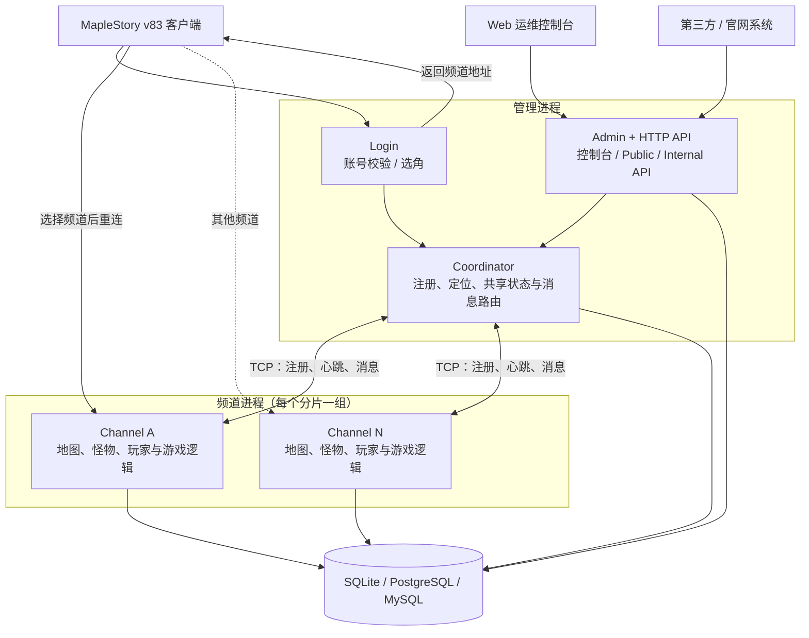

# Twinkle

面向 **MapleStory v83** 的现代化服务端与 Web 运维控制台。

Twinkle 使用 Java 21 重写传统冒险岛服务端的运行底座，重点解决旧项目中逻辑与状态耦合、更新依赖停服、部署形态固定、运维能力薄弱等问题。它既能以单进程运行在低配机器上，也能按频道拆分为多进程或多机部署，并通过统一的热更新、插件、API 和审计体系持续扩展。

> 项目目前处于积极开发阶段，适合参与开发、架构研究和测试验证，尚未作为“下载即开服”的稳定发行版交付。真实 v83 客户端兼容性验收与部分完整玩法仍在推进。

## 项目特点

- **v83 协议栈**：基于 Netty 实现登录服、频道服、封包编解码、加解密与 Handler 注册机制，自动化测试已覆盖握手、登录、选角和进图主链路。
- **分层热更新**：配置、GraalVM JavaScript 脚本、游戏逻辑与进程重启分别对应 L1–L4；游戏状态与可替换逻辑分离，降低更新时的停服与丢档风险。
- **一套代码，多种拓扑**：同一套模块可装配为单 JVM、单机多进程或跨机分布式部署；低配环境无需额外运行注册中心、缓存或消息队列。
- **多数据库支持**：内置自研迁移器与方言层，可按规模选择 SQLite、PostgreSQL、MySQL 或 MariaDB。
- **现代化运维控制台**：提供频道与在线玩家监控、账号和角色查询、配置热改、运维操作、后台任务、API Key、角色权限与审计日志等能力。
- **安全的扩展入口**：公共 API 按主版本发布，使用 API Key、Scope、限流和审计；管理端使用管理员会话、RBAC 与写操作原因审计。
- **插件与脚本扩展**：插件通过独立 ClassLoader 和版本化 SPI 接入，NPC、任务等脚本由 GraalVM JavaScript 执行并支持热重载。
- **中英文支持**：Java 服务端文案支持 `zh-CN` / `en-US`，Web 控制台拥有独立的界面语言设置。

## Web 运维控制台

`twinkle-web` 不是演示页面，而是与服务端管理 API 对接的正式控制台。目前包含：

- 运行概览、频道状态与在线玩家
- 账号管控与角色数据快照
- 配置中心、脚本/逻辑重载与重启操作
- 后台任务执行、调度、历史与失败重试
- API Key 生命周期与 Scope 管理
- 管理员角色、权限与审计日志
- 临时封包监听与敏感 opcode 强制过滤
- 浅色/深色主题及中文/英文界面

控制台采用 React 19、TypeScript、Vite、TanStack Query、Tailwind CSS v4 和 shadcn `radix-nova` 构建。

## 架构概览

Twinkle 的进程边界由运行配置决定。`single` / `standalone` 将全部角色装配在一个 JVM 中；`split-channel` / `split-realm` 则使用一个管理进程协调多个频道进程，业务代码不因部署方式改变。



在单进程模式中，上图的管理角色和频道角色位于同一 JVM，进程间调用自动替换为 EventBus、内存索引和方法调用；拆分部署后，同一接口改由 Netty 长连接、网络 RPC 和跨进程状态迁移实现。

服务端按职责拆分为 15 个 Maven 模块，依赖保持单向无环：

| 分层 | 模块 | 职责 |
| --- | --- | --- |
| 公共底座 | `core`、`net-packet`、`net-netty`、`data`、`db-dialect`、`plugin-api` | DI、事件、协议、网络、持久化、迁移与插件 SPI |
| 游戏域 | `domain-game`、`domain-script`、`wz-provider`、`channel` | 游戏状态、逻辑、脚本、WZ 数据与频道运行时 |
| 管理侧 | `coordinator`、`login`、`admin`、`http-api` | 大区协调、登录、运维控制台与版本化 API |
| 启动入口 | `bootstrap` | 读取 profile，并将所需角色装配进当前 JVM |

> 完整的设计决策、状态与逻辑边界、进程拓扑、热更新机制及性能红线，见 [ARCHITECTURE.md](ARCHITECTURE.md)。该文档是项目架构的权威说明。

## 当前进展

| 范围 | 状态 |
| --- | --- |
| 工程底座、数据层、迁移器与热更新基础 | 已实现 |
| v83 协议、登录/选角/进图自动化链路 | 已实现，真实客户端验收持续进行 |
| 游戏状态模型、WZ/脚本与核心逻辑系统 | 主体已实现，完整玩法与 parity 持续补齐 |
| 插件、L1–L4 热更新与频道间通信 | 已实现核心链路 |
| Web 控制台、版本化 API、RBAC 与审计 | 已投入正式业务开发 |
| 多进程/分布式与滚动重启 | 核心链路已实现，继续完善生产化细节 |

控制台的已完成范围和后续计划见 [控制台路线图](docs/in-progress/console-roadmap.md)，历史里程碑记录见 [任务归档](docs/archived/tasks/README.md)。

## 开发环境

- **GraalVM for JDK 21**：当前推荐 JDK `21.0.11`，须与 Maven 中的 GraalVM JS `23.1.11` 对应
- **Maven 3.8+**
- **Node.js 20+** 与 npm
- 与目标客户端匹配的 WZ XML 数据和服务端脚本

WZ 与脚本不随仓库分发，启动时分别通过 `TWINKLE_WZ_PATH` 和 `TWINKLE_SCRIPT_PATH` 指向本地目录。

### 验证服务端

```bash
cd twinkle-server
mvn -B verify
```

该命令会构建全部模块，并运行单元测试、集成测试、JaCoCo 覆盖率报告、ArchUnit 架构约束和日志纪律检查。

### 启动 Web 控制台

```bash
cd twinkle-web
npm install
npm run dev
```

开发服务器通过 `VITE_API_PROXY_TARGET` 指定后端地址。例如在 `twinkle-web/.env.local` 中写入：

```dotenv
VITE_API_PROXY_TARGET=http://127.0.0.1:8686
```

前端还提供以下质量检查命令：

```bash
npm run typecheck
npm run lint
npm test
npm run build
```

## 关键配置

| 环境变量 | 用途 | 默认值 |
| --- | --- | --- |
| `TWINKLE_PROFILE` | 运行拓扑 | `single` |
| `TWINKLE_DB_URL` | JDBC 数据库地址 | `jdbc:sqlite:./data/twinkle.db` |
| `TWINKLE_WZ_PATH` | WZ XML 数据目录 | 启动前应显式配置 |
| `TWINKLE_SCRIPT_PATH` | 服务端脚本目录 | 启动前应显式配置 |
| `TWINKLE_SERVICE_LANGUAGE` | 服务端语言 | `zh-CN` |
| `TWINKLE_LOGIN_PORT` | v83 登录端口 | `8484` |
| `TWINKLE_CHANNEL_PORT` | v83 频道端口 | `8584` |
| `TWINKLE_HTTP_PORT` | HTTP API 端口 | `8686` |

生产环境还必须配置稳定的服务端身份、Cursor 签名密钥、API 引导密钥，并在应用前配置 TLS、反向代理和防火墙。API 的版本与兼容规则见 [API 版本管理](docs/API-VERSIONING.md)，部署与回滚流程见 [上线切换文档](docs/archived/ops/switch-to-production.md)。

## 仓库结构

```text
twinkle/
├── twinkle-server/      # Java 21 / Micronaut 4 多模块服务端
├── twinkle-web/         # React 19 Web 运维控制台
├── docs/                # 规划中、进行中与已归档文档
├── ARCHITECTURE.md      # 架构与技术决策的权威说明
└── LICENSE
```

## 相关项目

Twinkle 在 v83 行为理解和兼容性验证过程中参考了 [BeiDou-Server](https://github.com/BeiDouMS/BeiDou-Server)。Twinkle 采用独立的数据模型、模块边界、迁移体系和运维架构，不兼容 BeiDou / newmaple 的旧数据库。

## 许可证

Twinkle 基于 [MIT License](LICENSE) 开源。MapleStory、客户端资源、WZ 数据及相关商标的权利归其各自权利人所有，这些内容不包含在本仓库的授权范围内。
